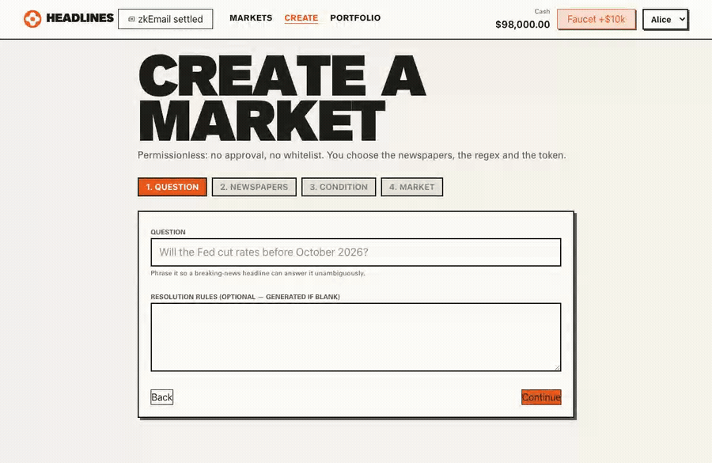
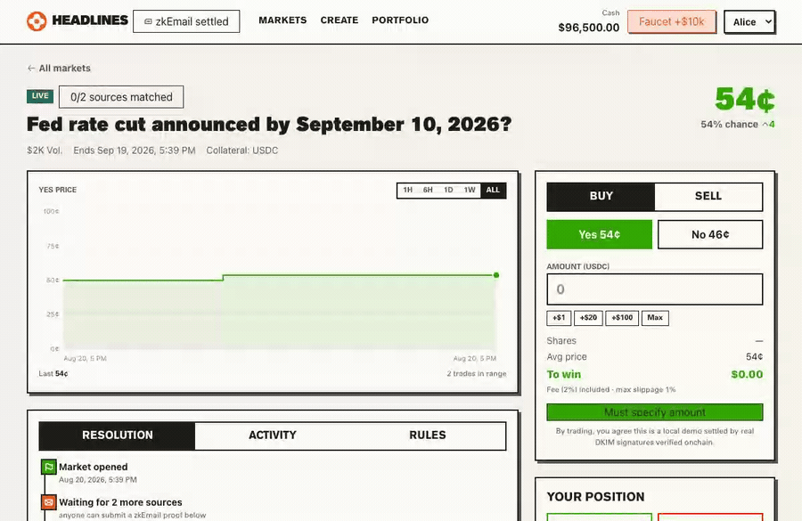

# Headlines — prediction markets settled by the newspapers themselves

Binary prediction markets where **settlement is a zkEmail proof of a newspaper
breaking-news alert email**. Anyone can permissionlessly:

- **open a market** over any set of newspapers, any regex condition, any ERC-20
  collateral token, and
- **settle a market** by submitting a proof of a matching alert email (or resolve
  NO after the deadline).

The token layer reimplements the Conditional Tokens model Polymarket settles on;
trading runs through a Gnosis-style fixed-product AMM (Polymarket's original venue).
Settlement is **real DKIM verification**: an email's RSA-SHA256 signature is checked
onchain (modexp precompile) against the sending domain's real published public key —
the same operation an inbound mail server performs. The real New York Times key and a
real NYT email verify end to end.

```
┌─────────────┐   creates    ┌────────────────┐   oracle-reports   ┌───────────────────┐
│MarketFactory├─────────────▶│ HeadlineMarket │───────────────────▶│ ConditionalTokens │
└─────────────┘              │  (the oracle)  │    [1,0] / [0,1]   │  (CTF-style 1155) │
                             └───▲────────────┘                    └─────────▲─────────┘
                                 │ submitProof(EmailProof)                   │ split/merge/redeem
                          ┌──────┴───────────┐                     ┌─────────┴─────────┐
                          │MockZKEmailVerifier│                    │       FPMM        │
                          │ + MockDKIMRegistry│                    │ (YES/NO AMM pool) │
                          └──────────────────┘                     └───────────────────┘
```

## See it in action

**Browse & trade** — market cards with live sparklines, a price-history chart with crosshair, and the Polymarket-style buy widget ("To win $X").


**Open a market, permissionlessly** — pick newspapers, write a regex with the live tester, set odds and liquidity.



**Settle with a real DKIM proof** — upload a signed `.eml`; its RSA-SHA256 signature is verified onchain against the newspaper's published key; the 2-of-3 threshold resolves the market YES.



## Repo layout

| Path | What |
|---|---|
| `contracts/` | Foundry project: RegexLib, ConditionalTokens, HeadlineMarket, FPMM, EIP-1167 factory, **real DKIM verification** (RSAVerify + DKIMRegistry + DKIMVerifier), 75-test suite |
| `app/` | Vite + React frontend built with [`@breadcoop/ui`](https://github.com/BreadchainCoop/bread-ui-kit) (bread-ui-kit), viem, Playwright e2e |
| `emails/` | Sample `.eml` files, DKIM-signed by the committed dev key (`pnpm dkim:sign-fixtures`) |
| `docs/` | [Architecture](docs/ARCHITECTURE.md) · [User flows](docs/USER-FLOWS.md) · [Newspapers](docs/NEWSPAPERS.md) · [Polymarket-parity backlog](docs/BACKLOG.md) |

## Quickstart

Prereqs: [Foundry](https://getfoundry.sh), Node 22+, pnpm.

```bash
# 1. chain (vanilla anvil works: every contract is under EIP-170 and settlement
#    fits ordinary blocks since the compiled-proof path landed)
anvil --port 8547

# 2. contracts — deploys the stack + 3 seeded demo markets, writes deployments/local.json
cd contracts
forge script script/Deploy.s.sol --rpc-url http://localhost:8547 --broadcast \
  --private-key 0xac0974bec39a17e36ba4a6b4d238ff944bacb478cbed5efcae784d7bf4f2ff80

# 3. app — syncs ABIs/addresses then serves on http://localhost:5199
cd ../app && pnpm install && pnpm dev
```

The header has a **faucet** (test USDC) and a **dev-account switcher** (Alice/Bob/Carol
= anvil's well-known accounts). To settle the seeded "Fed rate cut" market, open it and
upload `emails/nyt-fed-cut.eml`, then `emails/wapo-fed-cut.eml` — the second accepted
proof reaches the 2-of-3 threshold and resolves YES.

### Tests

```bash
cd contracts && forge test        # 75 tests: real RSA/DKIM, regex diff-vs-JS, CTF, FPMM, e2e
cd app && pnpm e2e                # 9 Playwright flows on an isolated anvil (port 8548)
```

The mock prover also runs standalone:

```bash
cd app && node scripts/prove-email.mjs ../emails/nyt-fed-cut.eml   # .eml -> EmailProof JSON
```

### Real zk-regex circuits (optional, ~10 min one-time ptau)

```bash
cd app
pnpm zk:build -- --from '^nytdirect@nytimes\.com$' --field 2 \
  --content '(?i)fed (cuts|lowers|slashes) (interest )?rates'   # regex -> DFA -> circom -> Groth16
pnpm zk:register        # deploy the generated verifier + register the pattern pair
pnpm zk:verify -- --submit   # prove a sample email for real and settle onchain (~2s prove, ~330k gas)
```

Once registered, the app's compiled settle mode generates the Groth16 proof
in-browser and the mock fallback is dead for that pattern.

## How settlement works

A market is configured at creation with:

- **sources** — up to 32 newspapers, each `{name, dkimDomain, fromRegex, contentRegex?}`,
- **contentRegex** — the headline condition, evaluated *onchain* by `RegexLib`
  (subset of JS regex: literals, `. * + ? {m,n}`, classes, groups, alternation,
  anchors, `\d \w \s`, `(?i)`); per-source overrides supported since papers word
  headlines differently,
- **contentField** — subject, body, or either,
- **threshold K** — distinct newspapers required for YES (aggregate settlement),
- **window / deadline / buffer** — accepted email `Date` range; after
  `deadline + buffer` anyone can resolve NO.

`submitProof(sourceIndex, EmailProof)` — the proof carries the email's canonicalized
signed headers + its real RSA signature. Onchain, `DKIMVerifier`:
1. looks up the sending domain's RSA public key in `DKIMRegistry` (real DNS keys),
2. verifies the RSA-SHA256 signature over the header bytes (`RSAVerify` + the modexp
   precompile) — genuine DKIM verification, and
3. binds the extracted From/Subject by requiring they appear in the authenticated
   header.
The market then runs its regex (onchain `RegexLib`) over the **DKIM-verified Subject**,
dedupes by email nullifier, and marks the source. The K-th distinct source reports
payout `[1,0]` to ConditionalTokens; `resolveNo()` reports `[0,1]` after deadline +
buffer. The market contract *is* the oracle — no human, committee, or mock in the loop.

A separate **zk-regex research track** (`app/scripts/zkregex`) compiles a pattern to a
real Groth16 circuit (regex → DFA → circom, differentially tested on 12k cases) toward
privacy-preserving settlement — see backlog A3; it is decoupled from the live path.

## Market token management

Follows the Polymarket/Gnosis standard:

- Each market is a 2-slot **condition**; YES/NO are ERC-1155 positions fully
  collateralised by the market's ERC-20 (`splitPosition` 1 → 1 YES + 1 NO,
  `mergePositions` back, `redeemPositions` at the reported payout after resolution).
- **Collateral is configurable per market** (test USDC by default; the e2e suite also
  exercises an 18-decimal token).
- Trading via a per-market **FPMM**: constant-product AMM over the YES/NO pool,
  configurable fee accruing to LP shares, `distributionHint` sets opening odds.
  Prices are probabilities — displayed in cents, Polymarket-style.

## Trust model — what's real, what's assumed

| Component | Here | Production delta |
|---|---|---|
| Email authenticity | **REAL** DKIM: RSA-SHA256 verified onchain (`RSAVerify` + modexp) against the domain's real public key in `DKIMRegistry`. The real NYT key + a real NYT email verify end to end. | Add key-rotation validity windows fed by a DNSSEC oracle (backlog A2); fold the DKIM RSA + SHA-256 into a zk circuit for private settlement (A1). |
| Test fixtures | The sample `.eml`s are signed by a **real** committed dev RSA key (`keys/dev-dkim.pub`), registered in the registry — real signatures, real verification, dev key (we can't hold NYT's private key). | Real senders sign their own real emails. |
| Regex | **REAL** onchain matcher (`RegexLib`) over the DKIM-verified Subject. | Compile to a zk circuit for privacy (A3; `app/scripts/zkregex` already does regex→DFA→Groth16). |
| Tokens / AMM / factory | **REAL** ConditionalTokens, FPMM, EIP-1167 clone factory. | Unchanged. |

Assumed (per spec): each newspaper publishes one canonical truth and never emails
conflicting alerts. The threshold K exists so a single compromised newsroom email
pipeline can't settle a market alone. Known limitation: only the **Subject** is bound
by the header signature — Body-field conditions need the DKIM body-hash (`bh=`) check
(backlog A4). See the [backlog](docs/BACKLOG.md) for the full roadmap.
